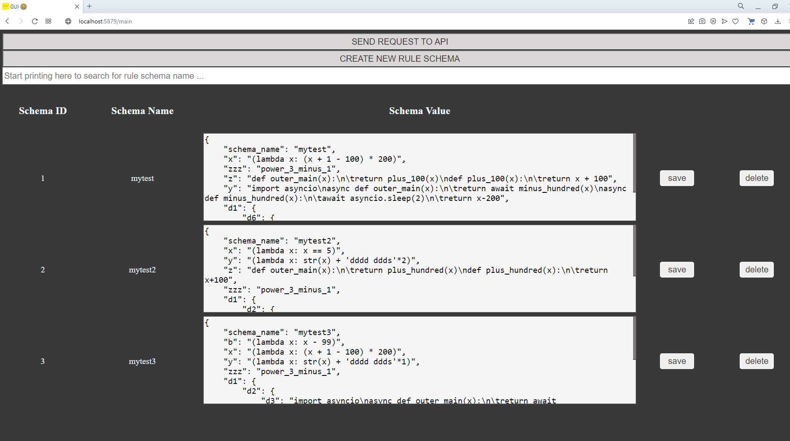

# user_defined_json_api_http_endpoints_example

### What is the app?

Once upon a time I was asked to write universal api handlers, which should be easy to setup by API user.

Surely if API is not plane simple, it is not possible to accomplish the task without some knowledge of programming
and writing some code in the server side, otherwise it will be much less programming jobs today than we have right now.

To prove that API user should know some programming to create API endpoints for himself, I created this demo app. It is 
possible to say that the App is based on Pythons `exec` and `eval` built-in functions and makes API end user to write
some code himself in Apps GUI, then the code is used to process user test requests to API. The app works with json
test messages to API only.

The end user creates json Rule Schema in GUI. Rule schema is a json message, which should contain
"schema_name" key which value should be some string. Some example will be provided later in the text.
Then user sends test request to api with json in body, the message should also contain "schema_name" key with the same
value, it allows server to understand which Rule Schema should be used to process the message.



### How to run the App ?

**To run app locally for test or development purpose:**

1. create `venv`

2. install all requirement from `requirements.txt` file

3. `python -m aiohttp.web -H 0.0.0.0 -P 5879 http_server_app:init_func_standalone` - Windows

3. `python3 -m aiohttp.web -H 0.0.0.0 -P 5879 http_server_app:init_func_standalone` - Linux

**To run server app in docker container without `Docker-Compose`**

1. `cd user_defined_json_api_http_endpoints_example`

2. `docker build -t app .`

3. `docker run -d -v app_storage:"/usr/src/database" --name app -p 5879:5879 app`

### How can I write Rule Schema?

##### **NOTE: To create Rule Schemas you need to have some `Python` knowledge**

**Let's start from showing Test message json, the message will be used with all Rule schema examples:**

```json
{
    "schema_name": "mytest",
    "x": 4,
    "a": 6,
    "y": 100,
    "b": 1000,
    "d": "abc",
    "z": 15,
    "hh": 98,
    "ggg": 777,
    "zzz": 10,
    "d1": {
        "d6": {
            "d7": 9
        },
        "d2": {
            "d5": 100,
            "d3": 1,
            "d4": 2,
            "d22": 5
        },
        "d8": {
            "d9": 5
        },
        "z2": 1000
    }
}
```

The only interesting fact about the test message is that it should contain `"schema_name"` key.

**Let's show example of Rule schema which will do some stuff with "x" key value:**

Rule schema:

```json
{
    "schema_name": "mytest",
    "x": "(lambda x: (x + 1 - 100) * 200)"
}
```

If you look at `"x"` key value, you'll see that it is `Python` lambda function, the function is the rule which will be 
implemented to test schema `"x"` key value. So the results of test request processing will be:

Result:

```json
{ 
    "x": -19000
}
```

When you use lambda functions, you should use brackets `(` `)` which enclose lambda function.

**Let's provide example of "predefined" `sync` or `async` function usage in Rule Schema, all predefined function are stored in file
`http_server_app/user_api_predefined_functions/some_easy_func.py`**

So predefined functions are just functions which were predefined in App code, rather than end user in GUI.

Rule schema:

```json
{
    "schema_name": "mytest",
    "zzz": "power_3_minus_1"
}
```

Result:

```json
{
    "zzz": 999
}
```

**Let's create Rule schema which contains `sync` function which is defined by user in GUI:**

Rule schema:

```json
{
    "schema_name": "mytest",
    "z": "def outer_main(x):\n\treturn plus_100(x)\ndef plus_100(x):\n\treturn x + 100"
}
```

Pay attention that `def outer_main(x):` should also be in these handlers, it is the function which is "executed" by
server backend app.

Result:

```json
{
    "z": 115
}
```

**Let's create Rule schema which contains `async` function which is defined by user in GUI:**

Rule schema:

```json
{
    "schema_name": "mytest",
    "y": "import asyncio\nasync def outer_main(x):\n\treturn await minus_hundred(x)\nasync def minus_hundred(x):\n\tawait asyncio.sleep(2)\n\treturn x-200"
}
```

Pay attention that `def outer_main(x):` should also be in these handlers, it is the function which is "executed" by
server backend app.

Result:

```json
{
    "y": -100
}
```

**Let's create Rule schema handler for some key in inner level, e.g. "d7" key:**

Rule schema: 

```json
{
    "schema_name": "mytest",
    "d1": {
        "d6": {
            "d7": "(lambda x: x + 10)"
        }
    }
}
```

Result:

```json
{
    "d1_d6_d7": 19
}
```

**Rule Schema All Together**

```json
{
    "schema_name": "mytest",
    "x": "(lambda x: (x + 1 - 100) * 200)",
    "zzz": "power_3_minus_1",
    "z": "def outer_main(x):\n\treturn plus_100(x)\ndef plus_100(x):\n\treturn x + 100",
    "y": "import asyncio\nasync def outer_main(x):\n\treturn await minus_hundred(x)\nasync def minus_hundred(x):\n\tawait asyncio.sleep(2)\n\treturn x-200",
    "d1": {
        "d6": {
            "d7": "(lambda x: x + 10)"
        }
    }
}
```

**Other working Rule Schema examples**

**Note: ** do not forget to change schema_name in Test message json, to choose another Rule schema for it

```json
{
    "schema_name": "mytest2",
    "x": "(lambda x: x == 5)",
    "y": "(lambda x: str(x) + 'dddd ddds'*2)",
    "z": "def outer_main(x):\n\treturn plus_hundred(x)\ndef plus_hundred(x):\n\treturn x+100",
    "zzz": "power_3_minus_1",
    "d1": {
        "d2": {
            "d3": "adouble_minus_one",
            "d4": "power_3_minus_1"
        }
    },
    "d": "(lambda x: x + 'aaaaaaa bbbb')"
}
```

```json
{
    "schema_name": "mytest3",
    "b": "(lambda x: x - 99)",
    "x": "(lambda x: (x + 1 - 100) * 200)",
    "y": "(lambda x: str(x) + 'dddd ddds'*1)",
    "zzz": "power_3_minus_1",
    "d1": {
        "d2": {
            "d3": "import asyncio\nasync def outer_main(x):\n\treturn await minus_hundred(x)\nasync def minus_hundred(x):\n\tawait asyncio.sleep(1)\n\treturn x-10000",
            "d4": "import asyncio\nasync def outer_main(x):\n\treturn await minus_hundred(x)\nasync def minus_hundred(x):\n\tawait asyncio.sleep(2)\n\treturn x-20000"
        }
    },
    "a": "adouble_minus_one",
    "z": "import asyncio\nasync def outer_main(x):\n\treturn await minus_hundred(x)\nasync def minus_hundred(x):\n\tawait asyncio.sleep(2)\n\treturn x-30000"
}
```

### How to understand how the App works?

Main logic in `http_server_app/universal_api_json_message_handler/handler.py`. You also need to understand how `exec`,
`eval` works in Python.

Also you can check `http_server_app/user_api_predefined_functions/some_easy_func.py`
